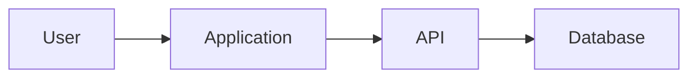

# Техническое задание — DaVinci Markdown Editor

> Кроссплатформенный нативно интегрированный Markdown-редактор для Windows и Linux с GitHub-совместимым рендерингом, Mermaid-схемами и Live Preview.

**Статус:** Draft / базовое ТЗ  
**Приоритет платформ:** Windows + Linux — обязательно (Tier-1); macOS — опционально (Tier-2)  
**Разработка:** с нуля  
**Рабочее название:** `DaVinci Markdown Editor`

---

## 1. Цель проекта

Разработать быстрое desktop-приложение для создания, открытия, просмотра и редактирования Markdown-файлов (`.md`, `.markdown`) с полноценным рендерингом содержимого в реальном времени.

Приложение должно ощущаться как нативная desktop-программа: устанавливаться в ОС, регистрироваться как обработчик Markdown-файлов, появляться в меню **«Открыть с помощью»**, поддерживать установку приложением по умолчанию и открывать документ по двойному клику в Explorer/файловом менеджере.

Основные ориентиры по поведению Markdown:

- GitHub Flavored Markdown (GFM);
- редактор уровня современных IDE;
- Preview в реальном времени;
- Mermaid-схемы как функция первого класса;
- корректное отображение кода, таблиц, изображений и математических формул;
- локальная работа без обязательного облака и аккаунта.

---

## 2. Целевые платформы

### Tier-1 — обязательно

- [ ] Windows 10 x64
- [ ] Windows 11 x64
- [ ] Linux x86_64
- [ ] Ubuntu/Debian-based Linux
- [ ] Kali Linux
- [ ] Fedora/RHEL-compatible — проверить сборку/пакетирование
- [ ] Arch-compatible — проверить запуск

### Tier-2 — по возможности

- [ ] macOS Intel
- [ ] macOS Apple Silicon
- [ ] Регистрация `.md`/`.markdown` в Finder
- [ ] Подписание/notarization macOS-сборки

**Важно:** отсутствие macOS-версии не блокирует релиз. Отсутствие полноценной Windows или Linux версии блокирует релиз.

---

## 3. Рекомендуемый технологический стек

| Компонент | Технология | Назначение |
|---|---|---|
| Desktop runtime | **Tauri 2** | Кроссплатформенная desktop-оболочка |
| Native/system core | **Rust** | Файловая система, IPC, watcher, OS integration |
| Frontend | **React + TypeScript** | UI приложения |
| Build frontend | **Vite** | Быстрая сборка |
| Editor | **CodeMirror 6** | Markdown source editor |
| Markdown pipeline | **unified + remark + rehype** | AST parsing/rendering |
| GFM | **remark-gfm** | GitHub Flavored Markdown |
| Mermaid | **Mermaid** | Диаграммы и схемы |
| Code highlight | **Shiki** | Подсветка fenced code blocks |
| Math | **KaTeX** | Формулы |
| Sanitization | **rehype-sanitize / собственная policy** | Безопасный HTML |
| File watching | Rust `notify` / Tauri layer | Внешние изменения файлов |
| Settings | JSON/TOML | Локальные настройки |

### Почему Tauri 2

- единая кодовая база Windows/Linux;
- Rust для системной интеграции;
- существенно легче типичного Electron-приложения;
- доступ к нативной файловой системе;
- установщики и desktop integration;
- frontend остаётся современным TypeScript-приложением;
- архитектура допускает последующую поддержку macOS.

Electron не является основным вариантом и должен использоваться только при появлении критического ограничения Tauri, которое невозможно разумно обойти.

---

## 4. Архитектура верхнего уровня

```text
                 ┌─────────────────────────────┐
                 │      React + TypeScript     │
                 │             UI              │
                 └──────────────┬──────────────┘
                                │
                  ┌─────────────▼─────────────┐
                  │       Editor Layer         │
                  │       CodeMirror 6         │
                  └─────────────┬─────────────┘
                                │
                  ┌─────────────▼─────────────┐
                  │      Markdown Engine       │
                  │ unified / remark / rehype  │
                  └──────┬──────┬──────┬──────┘
                         │      │      │
                     Mermaid  Shiki  KaTeX
                         │      │      │
                  ┌──────▼──────▼──────▼──────┐
                  │       Preview Engine       │
                  └─────────────┬──────────────┘
                                │ IPC
                  ┌─────────────▼──────────────┐
                  │       Tauri 2 / Rust       │
                  │ FS / Watcher / OS / Config │
                  └───────┬────────────┬───────┘
                          │            │
                      Windows        Linux
```

### Ключевой принцип

`Markdown Engine` не должен быть жёстко связан с UI. Парсер, расширения, sanitization и renderer проектируются отдельными модулями.

---

## 5. Нативная интеграция с ОС — критическое требование

### 5.1 Windows

После установки приложение должно:

- [ ] регистрироваться в системе как приложение, способное открывать `.md`;
- [ ] регистрироваться для `.markdown`;
- [ ] отображаться в **Open with / Открыть с помощью**;
- [ ] позволять пользователю назначить его приложением по умолчанию средствами Windows;
- [ ] получать путь к файлу при запуске из Explorer;
- [ ] открывать файл при двойном клике после назначения приложения по умолчанию;
- [ ] корректно работать с путями с пробелами;
- [ ] корректно работать с Unicode/кириллицей в путях;
- [ ] поддерживать несколько переданных файлов;
- [ ] поддерживать открытие файла во втором вызове приложения, когда экземпляр уже работает;
- [ ] иметь нормальную иконку приложения и иконку зарегистрированного типа документа;
- [ ] корректно удалять свои registration entries при uninstall там, где это допустимо моделью Windows.

Пример:

```text
C:\Docs\architecture.md
        ↓ double click
DaVinci Markdown Editor
        ↓
architecture.md открыт во вкладке
```

### 5.2 Linux

Приложение должно:

- [ ] устанавливать `.desktop` entry;
- [ ] регистрировать MIME association для Markdown;
- [ ] поддерживать `text/markdown`;
- [ ] отображаться в **Open With** файловых менеджеров;
- [ ] позволять назначить приложение обработчиком Markdown по умолчанию;
- [ ] принимать `%f/%F` или эквивалентные file arguments;
- [ ] открывать Markdown по двойному клику после выбора приложения по умолчанию;
- [ ] работать минимум в GNOME Files/Nautilus;
- [ ] проверить Dolphin;
- [ ] проверить Thunar;
- [ ] корректно обрабатывать Unicode paths;
- [ ] корректно открывать файл в существующем экземпляре приложения.

Ожидаемая desktop integration:

```ini
[Desktop Entry]
Name=DaVinci Markdown Editor
Exec=davinci-markdown %F
MimeType=text/markdown;
Terminal=false
Type=Application
Categories=Utility;TextEditor;Development;
```

Финальные параметры `.desktop` определить на этапе пакетирования.

### 5.3 Single-instance / multi-instance

Предпочтительное поведение по умолчанию:

```text
double click README.md
        ↓
существующий процесс найден
        ↓
путь передан главному экземпляру
        ↓
создаётся/активируется вкладка README.md
        ↓
окно выводится на передний план
```

- [ ] реализовать single-instance coordination;
- [ ] второй запуск не должен терять переданные file arguments;
- [ ] предусмотреть настройку `Open files in new window` в будущем.

---

## 6. Поддерживаемые файлы

Обязательно:

- [ ] `.md`
- [ ] `.markdown`
- [ ] UTF-8
- [ ] UTF-8 BOM
- [ ] LF
- [ ] CRLF

Желательно:

- [ ] определение других распространённых кодировок;
- [ ] выбор кодировки при открытии;
- [ ] изменение EOL;
- [ ] отображение текущей кодировки/EOL в status bar.

---

## 7. Основной UI

```text
┌────────────────────────────────────────────────────────────────────┐
│ File  Edit  View  Insert  Tools  Help                             │
├──────────────┬────────────────────────┬────────────────────────────┤
│ EXPLORER     │ EDITOR                 │ PREVIEW                    │
│              │                        │                            │
│ project/     │ # Architecture         │ Architecture               │
│ ├ README.md  │                        │                            │
│ ├ docs/      │ ```mermaid             │     ┌──────────┐           │
│ │ ├ api.md   │ flowchart LR           │     │ Client   │           │
│ │ └ arch.md  │ Client --> API         │     └────┬─────┘           │
│ └ images/    │ API --> DB             │          ▼                 │
│              │ ```                    │       ┌───────┐            │
│              │                        │       │  API  │            │
├──────────────┴────────────────────────┴────────────────────────────┤
│ Ln 14, Col 7 | UTF-8 | CRLF | Markdown | Saved                   │
└────────────────────────────────────────────────────────────────────┘
```

### Режимы

- [ ] Editor only
- [ ] Preview only
- [ ] Split horizontal
- [ ] Split vertical
- [ ] переключение Preview горячей клавишей
- [ ] сохранение выбранного layout между запусками

---

## 8. Вкладки документов

- [ ] несколько открытых Markdown-файлов;
- [ ] dirty indicator для несохранённых изменений;
- [ ] close tab;
- [ ] close others;
- [ ] close all;
- [ ] reopen closed tab — желательно;
- [ ] drag reorder;
- [ ] подтверждение закрытия изменённого файла;
- [ ] восстановление сессии — желательно.

---

## 9. Markdown Engine

### CommonMark

- [ ] headings;
- [ ] paragraphs;
- [ ] bold;
- [ ] italic;
- [ ] nested emphasis;
- [ ] blockquotes;
- [ ] ordered lists;
- [ ] unordered lists;
- [ ] nested lists;
- [ ] links;
- [ ] images;
- [ ] inline code;
- [ ] fenced code;
- [ ] horizontal rules.

### GitHub Flavored Markdown

- [ ] tables;
- [ ] task lists;
- [ ] strikethrough;
- [ ] autolinks;
- [ ] GitHub-style fenced code blocks;
- [ ] корректная комбинация GFM constructs.

Пример:

```markdown
## Release checklist

- [x] Parser
- [x] Preview
- [ ] Linux package
- [ ] Windows installer

| Platform | Status |
|---|---|
| Windows | Ready |
| Linux | Testing |
```

---

## 10. Mermaid — обязательная функция первого релиза

Пример исходника:

````markdown

````

В Preview должен отображаться непосредственно diagram SVG, а не code block.

### Поддержать

- [ ] Flowchart
- [ ] Sequence Diagram
- [ ] Class Diagram
- [ ] State Diagram
- [ ] Entity Relationship Diagram
- [ ] Gantt
- [ ] Git Graph
- [ ] Mindmap
- [ ] Timeline
- [ ] Pie Chart

### Ошибки Mermaid

Ошибка синтаксиса Mermaid не должна ломать документ или приложение.

Нужно показать:

```text
Mermaid render error
Line: 4
Unexpected token ...
```

- [ ] исходный код остаётся доступен;
- [ ] Preview остальных блоков продолжает работать;
- [ ] ошибка локализуется до конкретного diagram block;
- [ ] render выполняется с debounce;
- [ ] устаревший async render не должен перезаписывать более новый результат.

### Дополнительно

- [ ] Copy Mermaid as SVG;
- [ ] Export Mermaid as SVG;
- [ ] Export Mermaid as PNG — Phase 2;
- [ ] zoom diagram;
- [ ] fit diagram to viewport;
- [ ] шаблоны Mermaid через Insert → Diagram.

---

## 11. Редактор CodeMirror 6

- [ ] Markdown syntax highlighting;
- [ ] line numbers;
- [ ] current line highlight;
- [ ] bracket matching;
- [ ] autocomplete hooks;
- [ ] code folding;
- [ ] undo/redo;
- [ ] multi-cursor;
- [ ] selection;
- [ ] find;
- [ ] replace;
- [ ] regex search — желательно;
- [ ] case-sensitive toggle;
- [ ] word wrap;
- [ ] configurable tab size;
- [ ] configurable font size;
- [ ] configurable font family;
- [ ] drag & drop text;
- [ ] large-file performance.

### Горячие клавиши

| Действие | Windows/Linux |
|---|---|
| Open | `Ctrl+O` |
| Open Folder | `Ctrl+K Ctrl+O` или отдельная комбинация |
| Save | `Ctrl+S` |
| Save As | `Ctrl+Shift+S` |
| New | `Ctrl+N` |
| Find | `Ctrl+F` |
| Replace | `Ctrl+H` |
| Bold | `Ctrl+B` |
| Italic | `Ctrl+I` |
| Undo | `Ctrl+Z` |
| Redo | `Ctrl+Shift+Z` |
| Close tab | `Ctrl+W` |
| Settings | `Ctrl+,` |

Для macOS при реализации использовать соответствующие `Cmd` shortcuts.

---

## 12. Live Preview

Изменения должны отображаться практически сразу.

```text
Editor change
     ↓
debounce
     ↓
parse Markdown
     ↓
AST transforms
     ↓
GFM / Mermaid / Math / Code
     ↓
sanitize
     ↓
Preview update
```

- [ ] debounce ориентировочно 50–150 ms;
- [ ] отсутствие заметного мерцания;
- [ ] сохранение scroll position;
- [ ] синхронизация scroll Editor ↔ Preview;
- [ ] возможность отключить synchronized scroll;
- [ ] ссылки в Preview должны обрабатываться контролируемо;
- [ ] anchor navigation внутри документа.

---

## 13. Code blocks

Пример:

````markdown
```rust
fn main() {
    println!("Hello");
}
```
````

- [ ] language detection из fence info;
- [ ] Shiki highlighting;
- [ ] copy button;
- [ ] horizontal scroll;
- [ ] line wrapping setting;
- [ ] fallback для неизвестного языка;
- [ ] theme, соответствующая Light/Dark режиму.

---

## 14. Math

Поддержать KaTeX/совместимый синтаксис.

```markdown
Inline: $E = mc^2$

$$
P(A|B)=\frac{P(B|A)P(A)}{P(B)}
$$
```

- [ ] inline math;
- [ ] block math;
- [ ] безопасная обработка ошибок;
- [ ] ошибка формулы не должна ломать весь Preview.

---

## 15. Изображения и ресурсы

Поддержать:

```markdown

```

- [ ] relative paths;
- [ ] absolute local paths — с контролем доступа;
- [ ] PNG;
- [ ] JPEG;
- [ ] GIF;
- [ ] WebP;
- [ ] SVG с безопасной политикой;
- [ ] drag & drop image — Phase 2;
- [ ] paste image from clipboard — Phase 2;

Относительный путь должен разрешаться относительно текущего Markdown-файла/workspace, а не process working directory.

---

## 16. File Explorer / Workspace

Пользователь может открыть директорию:

```text
project/
├── README.md
├── CHANGELOG.md
├── docs/
│   ├── architecture.md
│   ├── api.md
│   └── database.md
└── images/
    └── architecture.png
```

Функции:

- [ ] Open Folder;
- [ ] directory tree;
- [ ] expand/collapse;
- [ ] create file;
- [ ] create folder;
- [ ] rename;
- [ ] delete с подтверждением;
- [ ] refresh;
- [ ] reveal current file;
- [ ] Markdown-first filtering;
- [ ] отображение других ресурсов при необходимости;
- [ ] context menu.

---

## 17. Файловый watcher

Если файл изменён внешней программой:

```text
File changed externally.

[Reload] [Keep local changes] [Compare]
```

Для MVP `Compare` допускается отложить.

- [ ] watcher не должен реагировать ошибочно на собственное сохранение;
- [ ] корректно обрабатывать rename/delete;
- [ ] не терять несохранённый пользовательский текст.

---

## 18. Autosave и восстановление

- [ ] manual save;
- [ ] configurable autosave;
- [ ] autosave after delay;
- [ ] autosave on focus lost — опционально;
- [ ] dirty state;
- [ ] crash/session recovery — Phase 2;
- [ ] атомарная запись там, где это практически возможно.

Главное правило: приложение не должно молча терять пользовательские изменения.

---

## 19. Outline / TOC

Из:

```markdown
# Project
## Architecture
### Backend
### Frontend
## Installation
```

создать навигационное дерево:

```text
Project
├─ Architecture
│  ├─ Backend
│  └─ Frontend
└─ Installation
```

- [ ] переход к heading;
- [ ] автоматическое обновление;
- [ ] collapse levels;
- [ ] highlight текущей секции — желательно.

---

## 20. Темы

Обязательно:

- [ ] Light;
- [ ] Dark;
- [ ] System;
- [ ] GitHub-like Light Preview;
- [ ] GitHub-like Dark Preview.

Настройки Editor и Preview должны быть визуально согласованы.

---

## 21. Settings

Категории:

### Editor
- font family;
- font size;
- line height;
- tab size;
- word wrap;
- line numbers;
- autosave.

### Preview
- theme;
- font size;
- synchronized scroll;
- Mermaid theme;
- code theme.

### Files
- restore previous session;
- recent workspaces;
- external change behavior.

### Application
- system theme;
- check for updates — Phase 2;
- telemetry: **off by default / отсутствует в MVP**.

---

## 22. Безопасность

Markdown-файл рассматривается как недоверенный локальный документ.

```text
Markdown
   ↓
Parser
   ↓
AST
   ↓
Allowed transforms
   ↓
Sanitization
   ↓
Controlled Preview
```

Требования:

- [ ] запрещено произвольное выполнение JavaScript из Markdown;
- [ ] raw HTML либо отключён по умолчанию, либо проходит строгую sanitization policy;
- [ ] event handlers (`onclick`, `onerror`, ...) запрещены;
- [ ] опасные URL schemes запрещены;
- [ ] Mermaid запускается в безопасной конфигурации;
- [ ] внешние ссылки не получают произвольный доступ к Tauri API;
- [ ] минимальные Tauri permissions/capabilities;
- [ ] CSP;
- [ ] локальный документ не должен иметь произвольный доступ ко всей файловой системе через Preview.

---

## 23. Производительность

Целевые показатели, уточняемые бенчмарками:

- [ ] холодный запуск на типичной машине: желательно ≤ 2 сек;
- [ ] обычный `.md` открывается визуально мгновенно;
- [ ] редактирование без perceptible input lag;
- [ ] Preview debounce ≤ 150 ms для обычного документа;
- [ ] файл 1 MB должен оставаться комфортно редактируемым;
- [ ] проверить 5–10 MB Markdown;
- [ ] Mermaid не должен блокировать основной UI надолго;
- [ ] тяжёлые преобразования профилировать.

Не следует обещать фиксированные цифры до измерения release build на целевом железе.

---

## 24. Экспорт — Phase 2

- [ ] Export HTML;
- [ ] Export PDF;
- [ ] Copy rendered HTML;
- [ ] Export Mermaid SVG;
- [ ] Export Mermaid PNG;
- [ ] Print.

Экспорт должен максимально сохранять внешний вид Preview.

---

## 25. Меню

### File

```text
New File
Open File...
Open Folder...
Open Recent >
Save
Save As...
Save All
Close
Exit
```

### Edit

```text
Undo
Redo
Cut
Copy
Paste
Find
Replace
```

### View

```text
Editor
Preview
Split View
Explorer
Outline
Word Wrap
Zoom In
Zoom Out
Reset Zoom
```

### Insert

```text
Link
Image
Table
Code Block
Task List
Diagram >
    Flowchart
    Sequence
    Class
    State
    ER
    Gantt
    Mindmap
```

---

## 26. Установщики и пакеты

### Windows

Минимум один нормальный install flow:

- [ ] MSI и/или NSIS installer;
- [ ] Start Menu entry;
- [ ] uninstall entry;
- [ ] app icon;
- [ ] file association registration;
- [ ] `Open with` integration;
- [ ] upgrade без потери settings;
- [ ] code signing подготовить архитектурно, даже если сертификат появится позже.

### Linux

Желательные артефакты:

- [ ] `.deb` — обязательно для первого Linux-релиза;
- [ ] AppImage — желательно;
- [ ] `.rpm` — желательно;
- [ ] `.desktop` file;
- [ ] MIME registration;
- [ ] icons в необходимых размерах;
- [ ] uninstall/upgrade path.

---

## 27. CLI / shell integration

Желательно зарегистрировать executable:

```bash
davinci-markdown README.md
```

и:

```bash
davinci-markdown ./docs/
```

Windows:

```powershell
davinci-markdown.exe README.md
```

- [ ] file argument;
- [ ] multiple files;
- [ ] folder argument;
- [ ] `--new-window` — Phase 2;
- [ ] `--version`;
- [ ] `--help`.

---

## 28. Предлагаемая структура репозитория

```text
davinci-markdown/
├── src/
│   ├── app/
│   ├── components/
│   ├── editor/
│   │   ├── codemirror/
│   │   ├── extensions/
│   │   └── keybindings/
│   ├── markdown/
│   │   ├── parser/
│   │   ├── renderer/
│   │   ├── gfm/
│   │   ├── mermaid/
│   │   ├── math/
│   │   ├── code/
│   │   └── sanitize/
│   ├── preview/
│   ├── explorer/
│   ├── outline/
│   ├── workspace/
│   ├── settings/
│   ├── tabs/
│   ├── themes/
│   └── shared/
│
├── src-tauri/
│   ├── src/
│   │   ├── main.rs
│   │   ├── lib.rs
│   │   ├── filesystem.rs
│   │   ├── watcher.rs
│   │   ├── workspace.rs
│   │   ├── instance.rs
│   │   ├── file_association.rs
│   │   ├── settings.rs
│   │   └── commands/
│   ├── capabilities/
│   ├── icons/
│   ├── Cargo.toml
│   └── tauri.conf.json
│
├── tests/
│   ├── markdown/
│   ├── mermaid/
│   ├── filesystem/
│   └── fixtures/
│
├── scripts/
├── docs/
├── package.json
├── tsconfig.json
└── README.md
```

---

## 29. Состояние приложения

Рекомендуемые основные модели состояния:

```ts
interface DocumentState {
  id: string;
  path: string | null;
  title: string;
  content: string;
  dirty: boolean;
  encoding: string;
  eol: "LF" | "CRLF";
  lastSavedHash?: string;
}

interface WorkspaceState {
  rootPath: string | null;
  openDocuments: string[];
  activeDocumentId: string | null;
}
```

Не хранить весь UI state в одном монолитном store без необходимости.

---

## 30. Обработка открытия файла из ОС

Обязательный сценарий тестирования:

```text
OS
 │
 │ open architecture.md
 ▼
Tauri/Rust entry point
 │
 ├─ normalize path
 ├─ validate file
 ├─ detect existing instance
 │
 ├── existing instance ──► IPC ──► openDocument(path)
 │
 └── new instance ───────► boot ──► openDocument(path)
                                      │
                                      ▼
                                Editor + Preview
```

### Acceptance criteria

- [ ] двойной клик не создаёт пустое окно вместо документа;
- [ ] путь не теряется во время startup;
- [ ] файл с пробелами открывается;
- [ ] кириллический путь открывается;
- [ ] несколько выбранных `.md` файлов открываются;
- [ ] второй вызов корректно передаётся запущенному экземпляру;
- [ ] окно активируется/поднимается;
- [ ] ошибки доступа показываются пользователю, а не приводят к crash.

---

## 31. Ошибки и UX

Не показывать пользователю сырой panic/stack trace как основной интерфейс ошибки.

Пример:

```text
Не удалось открыть файл

/home/user/docs/readme.md

Permission denied.

[OK]
```

Логи для диагностики могут содержать технические детали.

- [ ] глобальный error boundary frontend;
- [ ] Rust errors переводятся в структурированные IPC errors;
- [ ] crash/panic не должен приводить к молчаливой потере данных;
- [ ] логирование без содержимого приватных документов по умолчанию.

---

## 32. Тестирование

### Unit

- [ ] Markdown parsing;
- [ ] GFM;
- [ ] Mermaid block detection;
- [ ] path normalization;
- [ ] settings serialization;
- [ ] sanitization rules.

### Integration

- [ ] open/save;
- [ ] external modification;
- [ ] relative images;
- [ ] tabs;
- [ ] workspace;
- [ ] Mermaid rendering;
- [ ] malformed Mermaid;
- [ ] malformed Markdown/HTML.

### OS integration — Windows

- [ ] clean install;
- [ ] Open With;
- [ ] set default app manually;
- [ ] double click `.md`;
- [ ] `.markdown`;
- [ ] Unicode path;
- [ ] existing instance;
- [ ] uninstall;
- [ ] upgrade.

### OS integration — Linux

- [ ] clean `.deb` install;
- [ ] application menu;
- [ ] MIME association;
- [ ] Open With;
- [ ] double click `.md`;
- [ ] Unicode path;
- [ ] GNOME/Nautilus;
- [ ] existing instance;
- [ ] uninstall/upgrade.

---

## 33. CI/CD

Минимальный pipeline:

```text
push / pull request
       ↓
TypeScript lint/typecheck
       ↓
Rust fmt/clippy/test
       ↓
frontend tests
       ↓
integration tests
       ↓
build Windows
       ↓
build Linux
       ↓
package artifacts
```

- [ ] reproducible release process;
- [ ] versioning SemVer;
- [ ] release notes;
- [ ] checksums для релизных файлов;
- [ ] signing добавить после появления ключей/сертификатов.

---

## 34. Этапы разработки

### Phase 0 — Bootstrap

- [ ] создать repository;
- [ ] Tauri 2;
- [ ] React;
- [ ] TypeScript;
- [ ] Vite;
- [ ] Rust toolchain;
- [ ] lint/format;
- [ ] CI skeleton;
- [ ] базовая структура модулей.

### Phase 1 — Core editor

- [ ] открыть файл;
- [ ] CodeMirror;
- [ ] редактирование;
- [ ] save/save as;
- [ ] dirty state;
- [ ] basic Markdown preview.

### Phase 2 — Markdown engine

- [ ] CommonMark;
- [ ] GFM;
- [ ] tables;
- [ ] task lists;
- [ ] links/images;
- [ ] Shiki;
- [ ] KaTeX;
- [ ] sanitization.

### Phase 3 — Mermaid

- [ ] Mermaid renderer;
- [ ] error handling;
- [ ] all required diagram types;
- [ ] debounce;
- [ ] theme integration;
- [ ] SVG copy/export.

### Phase 4 — Workspace/UI

- [ ] Explorer;
- [ ] tabs;
- [ ] outline;
- [ ] split view;
- [ ] synchronized scroll;
- [ ] themes;
- [ ] settings;
- [ ] recent files.

### Phase 5 — Native OS integration

- [ ] Windows file association;
- [ ] Windows Open With;
- [ ] Windows double click;
- [ ] Linux `.desktop`;
- [ ] Linux MIME association;
- [ ] Linux Open With;
- [ ] Linux double click;
- [ ] single-instance file forwarding.

### Phase 6 — Packaging

- [ ] Windows installer;
- [ ] Linux `.deb`;
- [ ] AppImage;
- [ ] icons;
- [ ] upgrade test;
- [ ] clean-machine tests.

### Phase 7 — Hardening

- [ ] performance profiling;
- [ ] large files;
- [ ] malformed Markdown;
- [ ] malformed Mermaid;
- [ ] XSS/security tests;
- [ ] crash recovery;
- [ ] regression suite.

### Phase 8 — Optional macOS

- [ ] build;
- [ ] file association;
- [ ] Finder integration;
- [ ] Intel/ARM64;
- [ ] signing/notarization.

---

## 35. MVP Definition of Done

MVP считается готовым только если выполнено всё ниже:

- [ ] приложение собирается с нуля из репозитория;
- [ ] Windows release build работает;
- [ ] Linux release build работает;
- [ ] `.md` открывается из приложения;
- [ ] `.md` открывается двойным кликом после назначения приложения обработчиком;
- [ ] `.markdown` поддерживается;
- [ ] Open With работает;
- [ ] существующий экземпляр принимает новый файл;
- [ ] редактирование работает;
- [ ] сохранение работает;
- [ ] GFM работает;
- [ ] таблицы работают;
- [ ] task lists работают;
- [ ] code highlighting работает;
- [ ] Mermaid работает;
- [ ] Mermaid error не ломает приложение;
- [ ] relative images работают;
- [ ] Light/Dark работают;
- [ ] Preview обновляется в реальном времени;
- [ ] приложение не выполняет произвольный JS из Markdown;
- [ ] Windows installer готов;
- [ ] Linux `.deb` готов;
- [ ] проведён smoke test на чистой Windows;
- [ ] проведён smoke test на чистом Linux.

---

## 36. Не входит в обязательный MVP

Следующие функции не должны задерживать первый стабильный релиз:

- [ ] macOS;
- [ ] облачная синхронизация;
- [ ] аккаунты;
- [ ] collaboration;
- [ ] AI assistant;
- [ ] Git client;
- [ ] plugin marketplace;
- [ ] WYSIWYG mode;
- [ ] mobile version;
- [ ] встроенный браузер;
- [ ] telemetry/analytics.

Архитектура при этом не должна намеренно блокировать их появление в будущем.

---

## 37. Критические технические принципы

1. **Windows и Linux равноправны.** Linux не является «потом портируем».
2. **Нативная интеграция обязательна.** Пользователь открывает `.md` двойным кликом как обычный документ.
3. **Mermaid — core feature, а не плагин после релиза.**
4. **GitHub Flavored Markdown — базовый dialect.**
5. **Документ считается недоверенным вводом.** Preview не исполняет произвольный код.
6. **Никакой потери данных.** Dirty state, ошибки записи и external modifications обрабатываются явно.
7. **Markdown engine отделён от UI.**
8. **Не оптимизировать только под dev machine.** Проверять clean Windows/Linux environments.
9. **macOS — bonus.** Не задерживает Windows/Linux release.
10. **Проект пишется с нуля**, без зависимости от чужого desktop editor как основы.

---

## 38. Финальный стек

```text
Desktop:       Tauri 2
Native Core:   Rust
Frontend:      React + TypeScript
Bundler:       Vite
Editor:        CodeMirror 6
Markdown:      unified + remark + rehype
GFM:           remark-gfm
Diagrams:      Mermaid
Code:          Shiki
Math:          KaTeX
Security:      rehype-sanitize + CSP + Tauri capabilities
Platforms:     Windows + Linux (Tier-1)
Optional:      macOS (Tier-2)
```

---

## 39. Итоговый пользовательский сценарий

```text
Установил DaVinci Markdown Editor
              ↓
ОС знает, что приложение умеет открывать .md/.markdown
              ↓
Пользователь назначил его приложением по умолчанию
              ↓
Двойной клик README.md
              ↓
DaVinci Markdown Editor
              ↓
┌───────────────────┬──────────────────────────┐
│ Markdown source   │ Rendered Preview         │
│                   │                          │
│ # Architecture    │ Architecture             │
│                   │                          │
│ ```mermaid        │ [отрендеренная схема]    │
│ flowchart LR      │                          │
│ A --> B           │                          │
│ ```               │                          │
└───────────────────┴──────────────────────────┘
              ↓
Редактирование → Live Preview → Ctrl+S
```

**Главный критерий продукта:** пользователь должен воспринимать программу как полноценный системный Markdown-редактор, а не как веб-страницу, упакованную в desktop-окно.
