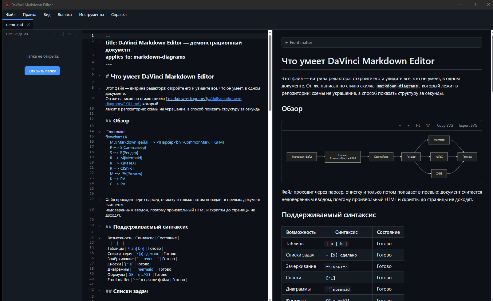
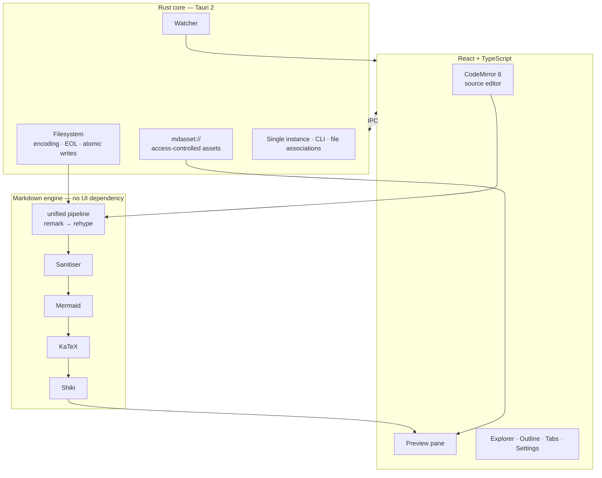

<div align="center">


# DaVinci Markdown Editor

**A Markdown editor that behaves like a document, not like a web page in a window.**

GitHub Flavored Markdown · Mermaid diagrams · KaTeX math · Shiki highlighting · live preview ·
native file associations on Windows, Linux and macOS

[](https://github.com/Ydjin1984/davinci-markdown-editor/actions/workflows/ci.yml)
[](https://tauri.app)
[](https://www.rust-lang.org)
[](https://react.dev)
[](LICENSE)
[](#testing)
[](#install)



</div>

---

## Why this one

**It installs as a document handler.** Double-click a `.md` file in Explorer or your file manager
and it opens in a tab of the running window — a second launch hands the path to the first instead
of starting another process. No account, no cloud, nothing phoning home.

**Diagrams are a first-class feature, not a plugin.** Mermaid is rendered, zoomable and exportable
as SVG, and a diagram that fails to parse shows an error card _with its source still visible_ while
the rest of the document keeps rendering.

**Nothing is lost.** Saves are atomic, the watcher detects external edits and never mistakes your
own save for one, and a file that changed on disk is not overwritten without asking.

**A Markdown file is untrusted input.** Raw HTML is sanitised, KaTeX runs with `trust` disabled,
the preview cannot read outside the folders you opened, and the webview holds almost no Tauri
permissions at all.

**It exports properly.** PDF is real, selectable, paginated text laid out by the same engine that
drew the preview. HTML is one self-contained file — stylesheets, images and the 19 KaTeX web fonts
embedded — that opens correctly on a machine that has never seen this project.

**It starts instantly and stays small.** Measured on the release build: a usable window in about
110 ms, and roughly 25 MB of resident memory while editing. There is no runtime to boot first.

---

## Install

### Windows 10 / 11

Download from the [releases page](https://github.com/Ydjin1984/davinci-markdown-editor/releases).

| File          | Notes                                                                  |
| ------------- | ---------------------------------------------------------------------- |
| `…-setup.exe` | NSIS installer, recommended. Per-user, no administrator rights needed. |
| `….msi`       | MSI for managed deployments.                                           |

Both register `.md`, `.markdown`, `.mdown`, `.mkdn` and `.mkd`, add an **Open with** entry, and
remove their registration on uninstall. WebView2 is required and is already present on Windows 10
1803+ and Windows 11.

SmartScreen warns about an unknown publisher because the installers are not code-signed yet;
_More info → Run anyway_ continues.

### Linux

| Distribution               | Install                                                                 |
| -------------------------- | ----------------------------------------------------------------------- |
| **Debian / Ubuntu / Kali** | `sudo apt install ./DaVinci.Markdown.Editor_<version>_amd64.deb`        |
| **Fedora / RHEL**          | `sudo dnf install ./DaVinci.Markdown.Editor-<version>-1.x86_64.rpm`     |
| **Any**                    | `chmod +x DaVinci.Markdown.Editor_<version>_amd64.AppImage` then run it |

The `.deb` and `.rpm` declare their WebKitGTK and GTK dependencies, install a desktop entry and
register `text/markdown`, so the application appears in _Open With_ and can be set as the default
handler. The AppImage carries its own WebKit stack, which is why it is much larger — prefer a
package for your distribution when one is available.

To make it the default for Markdown files:

```bash
xdg-mime default "DaVinci Markdown Editor.desktop" text/markdown
```

> The desktop file keeps the name the bundler derives from the product name, which contains spaces
> — hence the quotes. The graphical route (_Properties → Open With → Set as default_) does not need
> it.
>
> To remove the package later, use the name from the control file rather than the file name of the
> download: `sudo apt remove da-vinci-markdown-editor` (Debian family) or
> `sudo dnf remove da-vinci-markdown-editor` (Fedora family). The `.desktop` entry ships with
> `Exec=davinci-markdown %F`, so double-clicking a Markdown file opens it in the running window, and
> with `MimeType=text/markdown` the entry appears in _Open With_ as soon as the package is
> installed — no session restart needed.
>
> The AppImage cannot register file associations, because it installs nothing. It is the right
> choice for trying the editor; use a package if you want `.md` to open in it.

### macOS 10.15 Catalina or newer

| Machine                                     | File                  |
| ------------------------------------------- | --------------------- |
| Apple Silicon (M1/M2/M3/M4)                 | `…_aarch64.dmg`       |
| Intel                                       | `…_x64.dmg`           |

Open the `.dmg`, drag **DaVinci Markdown Editor** onto the _Applications_ shortcut, then launch it
from _Applications_ — or, from a terminal, mount and copy it in one go:

```bash
VERSION=0.2.2        # or any later release
hdiutil attach ~/Downloads/DaVinci.Markdown.Editor_${VERSION}_aarch64.dmg
cp -R "/Volumes/DaVinci Markdown Editor/DaVinci Markdown Editor.app" /Applications/
hdiutil detach "/Volumes/DaVinci Markdown Editor"
xattr -dr com.apple.quarantine "/Applications/DaVinci Markdown Editor.app"
```

> **Gatekeeper.** The disk image is not code-signed, so a plain double-click on first launch ends in
> _"Apple could not verify … is free of malware"_ and the app will not start. Allow it once with
> **right-click the app → Open → Open**; every later launch is a normal double-click. The `xattr`
> line above clears the quarantine flag from the terminal instead, and the `cp -R` route skips
> Finder's drag-and-drop entirely. Nothing is notarised, so expect this on every machine the app is
> copied to.
>
> **File associations.** The bundle declares `md`, `markdown`, `mdown`, `mkdn` and `mkd` in
> `CFBundleDocumentTypes` with the `Editor` role and `LSHandlerRank: Default`, so macOS lists it in
> _Open With_ as soon as the app is in `/Applications`. To make it the system-wide default:
> right-click any Markdown file → _Get Info_ → _Open with_ → _DaVinci Markdown Editor_ →
> _Change All…_. macOS also honours `open -a "DaVinci Markdown Editor" notes.md`, and the
> command-line entry point works without any association at all:
>
> ```bash
> "/Applications/DaVinci Markdown Editor.app/Contents/MacOS/davinci-markdown" notes.md
> ```
>
> **What is inside.** `CFBundleIdentifier` is `io.davinci.markdown`, the executable is
> `Contents/MacOS/davinci-markdown` and the remaining configuration is `Contents/Resources/icon.icns`
> — the application icon, across the whole size ladder macOS asks for. The bundle declares
> `LSMinimumSystemVersion` 10.15 and `NSHighResolutionCapable`. Both architectures are built by the
> `macOS` job in [`.github/workflows/ci.yml`](.github/workflows/ci.yml) — `macos-14` for the
> `aarch64` image, `macos-13` for `x64` — and
> [`src-tauri/macos/entitlements.plist`](src-tauri/macos/entitlements.plist) holds the three WebKit
> entitlements (JIT, unsigned executable memory, library validation) that apply once the build is
> signed with a Developer ID certificate; with no certificate configured the app ships unsigned and
> the hardened runtime is not applied.

---

## Command line

```bash
davinci-markdown README.md                 # open a file
davinci-markdown README.md CHANGELOG.md    # open several as tabs
davinci-markdown ./docs/                   # open a folder as the workspace
davinci-markdown --version
davinci-markdown --help
```

Paths containing spaces and non-ASCII characters work on every platform, and anything opened while
the application is already running is handed to that instance rather than dropped.

---

## What it does

| Area          |                                                                                                                                                                                      |
| ------------- | ------------------------------------------------------------------------------------------------------------------------------------------------------------------------------------ |
| **Rendering** | CommonMark and GitHub Flavored Markdown: tables, task lists, strikethrough, autolinks, footnotes, and YAML or TOML front matter shown as a metadata card rather than a stray heading |
| **Diagrams**  | Flowchart, sequence, class, state, ER, Gantt, Git graph, mindmap, timeline and pie — with zoom, fit, and SVG copy or export                                                          |
| **Code**      | Shiki highlighting for every bundled grammar, loaded on demand, with a copy button per block and a theme matching the light or dark mode                                             |
| **Math**      | KaTeX inline and display, with a malformed formula isolated to its own block                                                                                                         |
| **Editor**    | CodeMirror 6: multi-cursor, code folding, bracket matching, find and replace, and per-tab undo history that survives switching tabs                                                  |
| **Preview**   | Debounced live update, editor↔preview scroll synchronisation, anchor navigation                                                                                                      |
| **Workspace** | Folder tree, create, rename, delete to the trash, outline panel, recent files                                                                                                        |
| **Export**    | PDF with real selectable text; a single self-contained HTML file                                                                                                                     |
| **Files**     | UTF-8, UTF-8 BOM, UTF-16 and legacy encodings; LF and CRLF preserved per file; atomic writes                                                                                         |
| **Themes**    | Light, Dark and System, applied to the shell and the preview together                                                                                                                |

---

## Keyboard shortcuts

| Action                       | Windows / Linux                  | macOS                   |
| ---------------------------- | -------------------------------- | ----------------------- |
| Open file                    | `Ctrl+O`                         | `⌘+O`                   |
| Open folder                  | `Ctrl+Shift+O`                   | `⌘+Shift+O`             |
| New file                     | `Ctrl+N`                         | `⌘+N`                   |
| Save                         | `Ctrl+S`                         | `⌘+S`                   |
| Save As                      | `Ctrl+Shift+S`                   | `⌘+Shift+S`             |
| Close tab                    | `Ctrl+W`                         | `Ctrl+W` [^macos-keys]  |
| Next / previous tab          | `Ctrl+Tab` / `Ctrl+Shift+Tab`    | `Ctrl+Tab` / `Ctrl+Shift+Tab` |
| Find / Replace               | `Ctrl+F` / `Ctrl+H`              | `⌘+F` / `Ctrl+H`        |
| Bold / Italic / inline code  | `Ctrl+B` / `Ctrl+I` / `Ctrl+E`   | `⌘+B` / `⌘+I` / `⌘+E`   |
| Link / image                 | `Ctrl+K` / `Ctrl+Shift+K`        | `⌘+K` / `⌘+Shift+K`     |
| Headings 1–4, clear          | `Ctrl+Shift+1…4`, `Ctrl+Shift+0` | `⌘+Shift+1…4`           |
| Bullet / ordered / task list | `Ctrl+Shift+8` / `7` / `9`       | `⌘+Shift+8` / `7` / `9` |
| Toggle preview               | `Ctrl+Shift+V`                   | `⌘+Shift+V`             |
| **Export as PDF**            | `Ctrl+P`                         | `⌘+P`                   |
| **Export as HTML**           | `Ctrl+Shift+E`                   | `⌘+Shift+E`             |
| Settings                     | `Ctrl+,`                         | `⌘+,`                   |

[^macos-keys]: Three `⌘` combinations belong to the system on macOS and never reach the editor, so
    the app accepts `Ctrl` for the same commands: `⌘W` is the native _Close Window_ item and closes
    the window, `⌘H` hides the application, and `⌘Tab` is the system application switcher. `⌘Q`
    is the standard Quit and works normally — the application menu's Quit item runs the same
    unsaved-changes prompt as closing the window instead of terminating outright. The shortcuts
    above are the ones that actually fire.

---

## Architecture



### Design decisions worth knowing

**The Markdown engine has no UI dependency.** `renderMarkdown(source, options)` takes a string and
returns HTML, an outline and the diagram sources. That keeps it testable on its own and reusable by
the export features.

**Sanitisation is the security boundary, and its position in the pipeline is deliberate.** Raw HTML
is parsed and then forced through a schema; KaTeX, Shiki and Mermaid run _after_ it, building markup
from text that has already been verified. KaTeX runs with `trust: false`, so `\href`, `\url` and
`\htmlClass` stay inert.

**The preview cannot read your disk.** Images resolve through `mdasset://`, which serves only files
under a directory you actually opened — the workspace root, the document's folder, or one of its
parent folders up to three levels — and only extensions that are safe to inline. Symlinks are
resolved before the check. _Tools → Preview Asset Access_ lists the current reach, and an image that
is refused explains why instead of showing a broken icon.

**The webview has almost no Tauri permissions.** File dialogs, shell integration and every
filesystem operation go through reviewed Rust commands rather than blanket plugin permissions; the
capability file grants only window and event access.

**Saving is atomic and never clobbers external edits.** Writes go to a sibling temp file, keep the
original permissions and are renamed into place. A save carries the hash of the content the editor
loaded; if the file changed underneath, the write is refused and you are asked what to do.

**The watcher recognises its own writes.** After a save, the resulting filesystem notification is
compared against the content just written and dropped, so `Ctrl+S` never raises a "changed on disk"
prompt against itself.

**Per-tab undo history survives tab switching.** One CodeMirror view is reused and the whole
`EditorState` is swapped, which preserves history without keeping a view per tab.

**Diagrams are cached by content and theme.** Unchanged diagrams are re-inserted from cache on the
next keystroke, and every render is generation-checked so a slow async render cannot overwrite a
newer result. Mermaid runs with `securityLevel: 'strict'` and SVG text labels rather than
`foreignObject`, so an exported SVG opens anywhere.

### Bundle size note

Shiki ships 600+ grammars and the build keeps them all available as lazily loaded chunks, which is
why `dist/` is ~17 MB. Only the ~13 common languages load eagerly; the rest are fetched the first
time a fence uses them. If installer size matters more than grammar coverage, restrict
`EAGER_LANGUAGES` in `src/markdown/code/highlighter.ts`.

---

## Agent skill

The repository ships [`skills/markdown-diagrams`](skills/markdown-diagrams/SKILL.md): an agent skill
that makes an AI assistant write Markdown this editor renders well — at least one Mermaid diagram
per document, chosen by what the section actually says, plus GFM tables for comparisons, task lists
for status, fenced code with a language, and KaTeX for formulas. It also lists the Mermaid mistakes
that stop a diagram rendering at all.

Copy the folder into your assistant and you get structured documents instead of walls of prose.
Installation paths are in [`skills/README.md`](skills/README.md). The
[demo document](docs/demo.md) is written in that style and makes a good first thing to open.

---

## Building from source

### Prerequisites

- **Node.js** ≥ 20.19 and npm
- **Rust** stable (1.82+)
- Platform toolchain:
  - **Windows** — Visual Studio Build Tools with _Desktop development with C++_. WebView2 is
    preinstalled on Windows 10 (1803+) and Windows 11.
  - **Debian / Ubuntu** —
    ```bash
    sudo apt install libwebkit2gtk-4.1-dev libgtk-3-dev \
      libayatana-appindicator3-dev librsvg2-dev patchelf build-essential
    ```
  - **Fedora / RHEL** —
    ```bash
    sudo dnf install webkit2gtk4.1-devel gtk3-devel libappindicator-gtk3-devel \
      librsvg2-devel patchelf
    ```
  - **Arch** — `sudo pacman -S webkit2gtk-4.1 gtk3 libappindicator-gtk3 librsvg patchelf`
  - **macOS** — Xcode command line tools.

```bash
npm install

npm run app:dev      # run with hot reload
npm run app:build    # release installers in src-tauri/target/release/bundle
```

### Verifying a checkout

```bash
npm run verify       # typecheck, lint, format, tests, clippy, cargo test
```

Individually:

```bash
npm run typecheck    # tsc --noEmit
npm run lint         # eslint
npm run test         # vitest
npm run fmt:rust     # cargo fmt
npm run lint:rust    # cargo clippy --all-targets -- -D warnings
npm run test:rust    # cargo test
```

---

## Testing

```bash
npm run test        # 119 frontend tests
npm run test:rust   # 69 Rust tests
```

**Frontend** (`tests/`) covers CommonMark and GFM output, outline extraction, Mermaid fence
detection, code block handling, KaTeX error isolation, front matter, asset URL resolution and the
sanitisation policy — the latter with explicit XSS vectors (`<script>`, `onerror`, `javascript:`,
`data:text/html`, `<iframe srcdoc>`, `<style>`, `<form>`, KaTeX `\href`). The menu bar has its own
regression test for a submenu that used to vanish as the pointer entered it.

**Rust unit tests** cover path normalisation and containment, CLI parsing, encoding and EOL helpers,
binary sniffing, BOM handling, settings forward-compatibility, workspace name validation and the
link policy.

**Rust integration tests** (`src-tauri/tests/`) exercise the real filesystem: UTF-8, BOM, CRLF and
`windows-1251` round trips, binary refusal, atomic replacement leaving no temporary file behind,
concurrent writers producing a complete file, `expectedHash` conflict detection, Unicode and spaced
paths, and the preview's asset access policy.

Cargo requires integration tests under `src-tauri/tests/`, so the repository has two test roots: the
`tests/` layout for the frontend suite and Cargo's convention for Rust.

### Manual checks before a release

Not automatable in CI. The full matrix — clean installs, file associations, double-click, Unicode
paths, single-instance hand-off, upgrade and uninstall across Windows, Linux and macOS — is in
[`docs/RELEASE-CHECKLIST.md`](docs/RELEASE-CHECKLIST.md).

---

## Project layout

```
src/                     React + TypeScript front end
├── app/                 Shell: menu bar, status bar, dialogs, toasts, error boundary
├── editor/              CodeMirror 6: setup, themes, Markdown commands, cursor store
├── markdown/            Markdown engine — deliberately UI-free
│   ├── renderer/        unified pipeline and custom rehype plugins
│   ├── sanitize/        hast-util-sanitize policy
│   └── code/            Shiki highlighter
├── mermaid/             Lazy renderer with caching and hydration
├── preview/             Preview pane, scroll sync, PDF and HTML export
├── explorer/  outline/  tabs/  settings/  workspace/
└── styles/              Application chrome, Markdown rendering, print layout

src-tauri/src/           Rust back end
├── commands.rs          Every operation the webview may request
├── filesystem.rs        Encoding and EOL detection, atomic writes
├── watcher.rs           Debounced filesystem watching
├── asset.rs             mdasset:// protocol with an access allow-list
├── links.rs             Policy for links handed to the operating system
├── workspace.rs         Directory listing and file operations
└── settings.rs  state.rs  paths.rs  cli.rs  error.rs  platform.rs

skills/markdown-diagrams/  Agent skill shipped with the project
docs/                      Demo document, release checklist, screenshots
```

---

## FAQ

**Does it phone home?** No. There is no telemetry, no account and no update check. The only
outbound access is opening a link you click, and the target is vetted first: only `http`, `https`
and `mailto`, and never the local machine or a private network.

**Can a Markdown file execute code?** No. Scripts and event handlers are stripped, raw HTML passes
through a strict schema, and the Content Security Policy forbids inline script. There is a test for
each of those.

**How large is it?** The Windows installer is under 6 MB, the Linux package about 7 MB and the macOS
disk image about 11 MB. A running window settles around 24–25 MB of resident memory, and reaches a
usable window in about 110 ms on the machine this was measured on. Your hardware will differ; the
figures come from the release build, not from a development one.

**Why is the AppImage so much bigger?** It bundles the WebKitGTK stack so it runs on any
distribution without installing dependencies. The `.deb` and `.rpm` use the system one.

**Does it handle large files?** A 1 MB document is comfortable; CodeMirror is built for that. Very
large files are worth benchmarking on your own hardware rather than trusting a number from someone
else's machine.

**Where are my settings?** `%APPDATA%\io.davinci.markdown\` on Windows,
`~/.config/io.davinci.markdown/` on Linux, `~/Library/Application Support/io.davinci.markdown/` on
macOS. `settings.json` and `session.json`, both written atomically; a file that cannot be parsed is
preserved rather than overwritten.

---

## Publisher

**DaVinci Cyber Engineering** — _Secure · Analyze · Engineer · Build_

|                     |                                                     |
| ------------------- | --------------------------------------------------- |
| Website             | <https://www.davinci-cyber-engineering.uz/>         |
| Email               | <info@davinci-cyber-engineering.uz>                 |
| Support the project | USDT · TRC20 · `TAnJB15jGXVtfKkwgs2pz5NFN5fN22ha41` |

Donations are voluntary and buy no support, features or licences. The same details, with a
scannable QR code, are in the application under _Help → About_.

## Licence

MIT — see [LICENSE](LICENSE).
