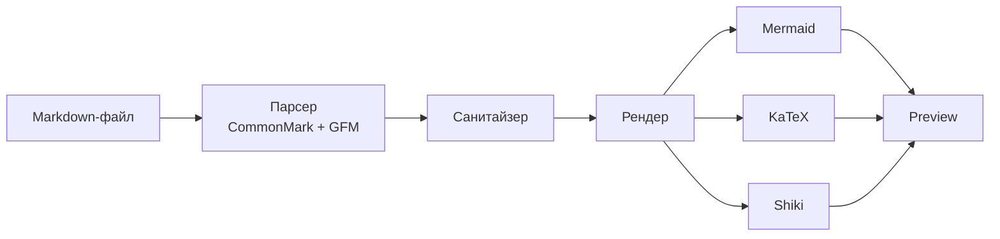
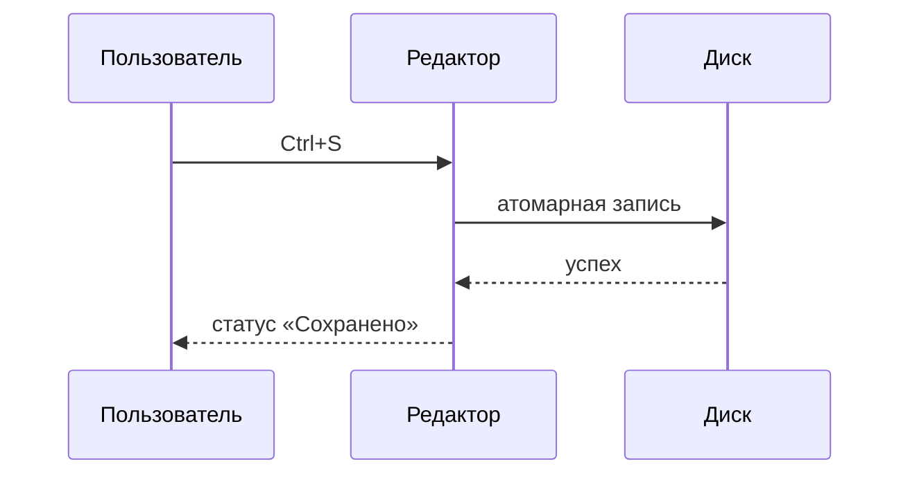
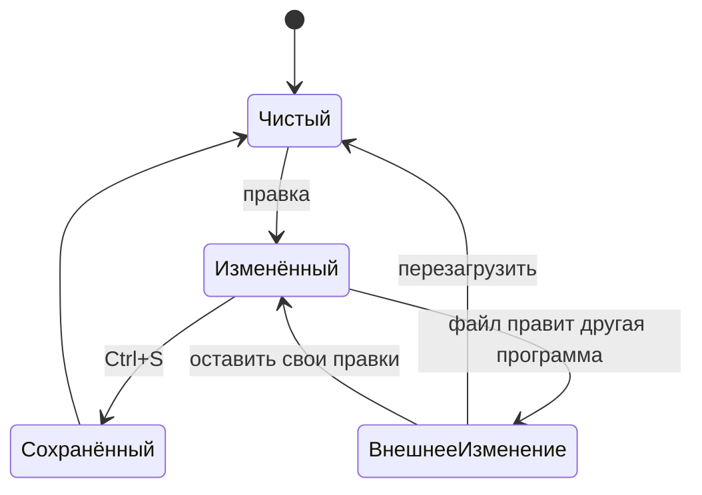
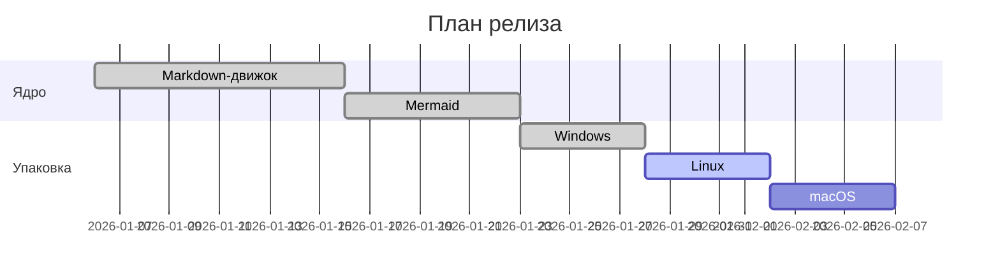
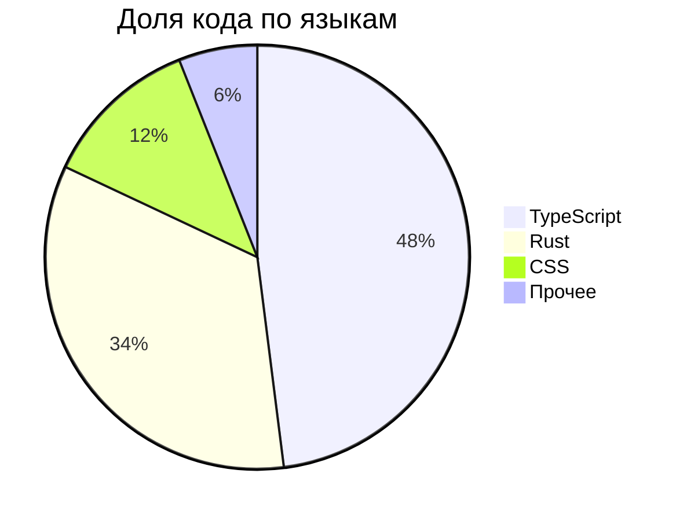

# Что умеет DaVinci Markdown Editor

Этот файл — витрина редактора: откройте его и увидите всё, что он умеет, в одном документе.
Он же написан по стилю скилла [`markdown-diagrams`](../skills/markdown-diagrams/SKILL.md), который
лежит в репозитории: схемы не украшение, а способ показать структуру за секунды.

## Обзор



Файл проходит через парсер, очистку и только потом попадает в превью: документ считается
недоверенным вводом, поэтому произвольный HTML и скрипты до страницы не доходят.

## Поддерживаемый синтаксис

| Возможность | Синтаксис | Состояние |
|---|---|---|
| Таблицы | `\| a \| b \|` | Готово |
| Списки задач | `- [x] сделано` | Готово |
| Зачёркивание | `~~текст~~` | Готово |
| Сноски | `[^1]` | Готово |
| Диаграммы | ` ```mermaid ` | Готово |
| Формулы | `$E = mc^2$` | Готово |
| Front matter | `---` в начале файла | Готово |

## Списки задач

- [x] CommonMark и GitHub Flavored Markdown
- [x] Mermaid, KaTeX, Shiki
- [x] Ассоциация файлов в ОС
- [x] Экспорт в PDF и самодостаточный HTML
- [ ] Пакет для macOS

## Схема последовательности



## Схема состояний



## Код

Подсветка работает для всех языков, которые поставляет Shiki, и подгружается по мере надобности.

```rust
fn write_bytes_atomic(target: &Path, bytes: &[u8]) -> Result<()> {
    let temp = unique_temp_path(target);
    fs::write(&temp, bytes)?;
    fs::rename(&temp, target)?;   // замена одним движением
    Ok(())
}
```

```typescript
const { html, outline } = await renderMarkdown(source, {
  allowRawHtml: true,
  renderMath: true,
  appearance: "dark",
});
```

## Математика

Вероятность коллизии при вставке в таблицу из $n$ записей:

$$
P \approx \frac{n(n-1)}{2 \cdot 62^6}
$$

Строка формул внутри текста: $E = mc^2$, $\int_0^\infty e^{-x^2}\,dx = \frac{\sqrt{\pi}}{2}$.

## Цитата и сноска

> Документ считается недоверенным вводом: превью не исполняет произвольный код.[^sanitize]

[^sanitize]: Очистка идёт по схеме `hast-util-sanitize`, расширенной только там, где Markdown
    действительно нуждается в расширении.

## Диаграмма Ганта



## Круговая диаграмма



## Итоги

- [x] Открывается двойным кликом как обычный документ
- [x] Обновляется по мере набора текста
- [x] Экспортируется в PDF с настоящим текстом
- [ ] Ждём пакет для macOS
