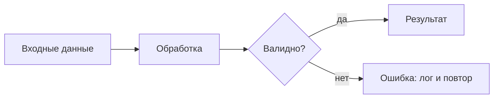
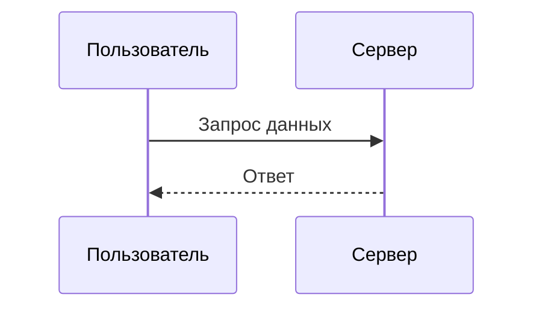

# Markdown со схемами — обязательный стиль документов

Цель: любой сохранённый `.md` — самодостаточный документ, где структура и связи показаны схемами, а не только текстом. Схема — не украшение: она фиксирует, как части документа связаны, и позволяет понять документ за секунды.

## Когда применять

- Создаётся новый `.md` файл — всегда, без исключений.
- Дописывается или правится существующий `.md` — новые разделы оформляй по этой методике.
- Тема не важна: код, отчёт, план, заметка, README, спецификация.
- Пользователь просит «просто сохранить в markdown» — стиль всё равно обязателен.

## Железные правила

1. **Минимум одна Mermaid-схема в каждом документе.** Документ длиннее ~150 строк — две и больше.
2. Тип схемы подбирай по содержанию (таблица ниже), а не наугад.
3. Схема стоит сразу после раздела, который иллюстрирует. Обзорная схема всего документа — сразу после вступления.
4. Один `# H1` на документ; разделы — `##`, подразделы — `###`.
5. Сравнения и перечисления фактов — GFM-таблицами; чек-листы — списками задач `- [ ]`; код — блоком с указанием языка; формулы — `$...$` и `$$...$$`; сноски — `[^имя]`; важное — цитатой `>`.
6. Язык документа совпадает с языком запроса пользователя.
7. Схема самодостаточна: подписи конкретные («Клиент шлёт POST /api/pay»), а не «шаг 1», «шаг 2».

## Выбор типа схемы

| Содержание раздела | Тип Mermaid |
|---|---|
| Архитектура, пайплайн, «как это устроено» | `flowchart TD` / `flowchart LR` |
| Взаимодействие участников, шаги операции | `sequenceDiagram` |
| Состояния, режимы, жизненный цикл | `stateDiagram-v2` |
| Классы, структура моделей данных | `classDiagram` |
| Схема БД, сущности и связи | `erDiagram` |
| План, этапы, расписание | `gantt` |
| Обзор темы, карта идей | `mindmap` |
| Доли, распределение | `pie` |

Один документ может сочетать несколько типов: например, обзорный `flowchart` + сценарий `sequenceDiagram` + таблица конечных точек.

## Синтаксис Mermaid — типичные ошибки

- Блоки схем — только тройные кавычки с языком `mermaid`.
- Метки со скобками, двоеточиями или запятыми бери в кавычки: `A["Шаг (первый): подготовка"]`.
- Не называй узел `end` — это зарезервированное слово; используй `fin` или `done`.
- Стрелки: `-->` последовательность; `-.->` возможный/опциональный путь; `==>` главный путь.
- Комментарии внутри схемы — `%%`.
- В `flowchart`: `LR` — для потоков данных, `TD` — для иерархий и решений.

## Каркас документа

````markdown
# Заголовок документа

Вступление: о чём документ и главный вывод — 1–2 предложения.

## Обзор



## Раздел

Текст раздела. Сравнение — таблицей:

| Вариант | Плюс | Минус |
|---|---|---|
| А | быстро | дорого |
| Б | дёшево | медленно |

## Сценарий



## Итоги

- [x] Что сделано
- [ ] Следующий шаг
````

## Чек-лист перед сохранением .md

- [ ] Есть хотя бы один блок с языком `mermaid`; тип схемы соответствует содержанию
- [ ] Метки со спецсимволами взяты в кавычки; нет узла с именем `end`
- [ ] Сравнения — таблицами; статусы — списками задач; код — с указанием языка
- [ ] Один `# H1`, иерархия `##`/`###` не нарушена
- [ ] Схемы стоят рядом с иллюстрируемым текстом

## Образец

Полный пример документа в этом стиле: [references/exemplar.md](references/exemplar.md). Сверяйся с ним, когда сомневаешься в оформлении.
