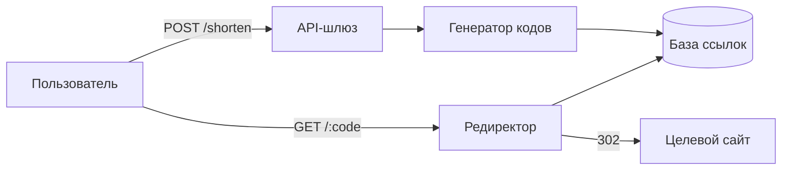
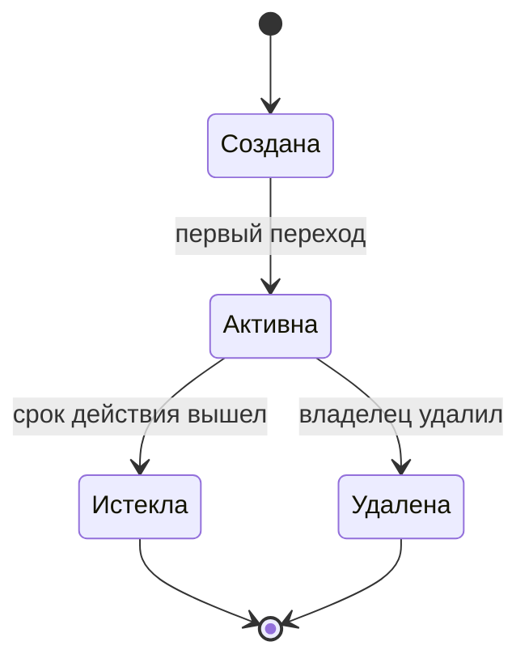
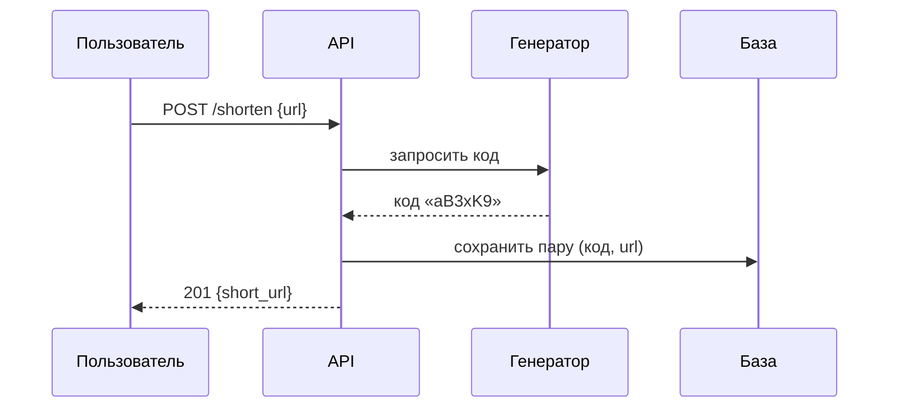

# Сервис сокращения ссылок — обзор

Документ описывает устройство сервиса сокращения ссылок: поток запроса, жизненный цикл ссылки и контракт API. Главный вывод: вся логика укладывается в два компонента — редиректор и генератор кодов.

## Обзор

Пользователь отправляет длинный URL и получает короткий код; переход по коду идёт через редиректор, который смотрит в базу ссылок.

## Жизненный цикл ссылки

## Сценарий: создание короткой ссылки

## Контракт API

| Метод | Путь | Ответ | Назначение |
|---|---|---|---|
| POST | `/shorten` | `201` | Создать короткую ссылку |
| GET | `/:code` | `302` | Перейти на целевой URL |
| DELETE | `/:code` | `204` | Удалить ссылку |

Коды генерируются из алфавита base62 длиной 6 символов — 56 млрд комбинаций[^cap].

[^cap]: При коллизии код перегенерируется до трёх раз, затем сдвигается длина.

## Статусы внедрения

- [x] Редиректор и генератор кодов
- [x] Таблица `links` с индексом по коду
- [ ] Кэш горячих ссылок (Redis)
- [ ] Метрики переходов

## Ограничение на коды

Вероятность коллизии при вставке оценивается как

$$
P \approx \frac{n(n-1)}{2 \cdot 62^6}
$$

где $n$ — число уже сохранённых ссылок.
