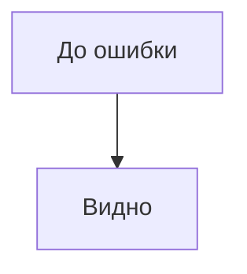
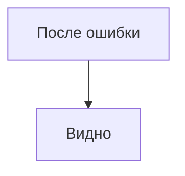

# Локальная ошибка

```mermaid
flowchart TD
  A["До ошибки"] --> B["Видно"]
```

```mermaid
flowchart TD
 A["Незакрытый узел
```

Этот текст должен остаться видимым.

```mermaid
flowchart TD
 C["После ошибки"] --> D["Видно"]
```
