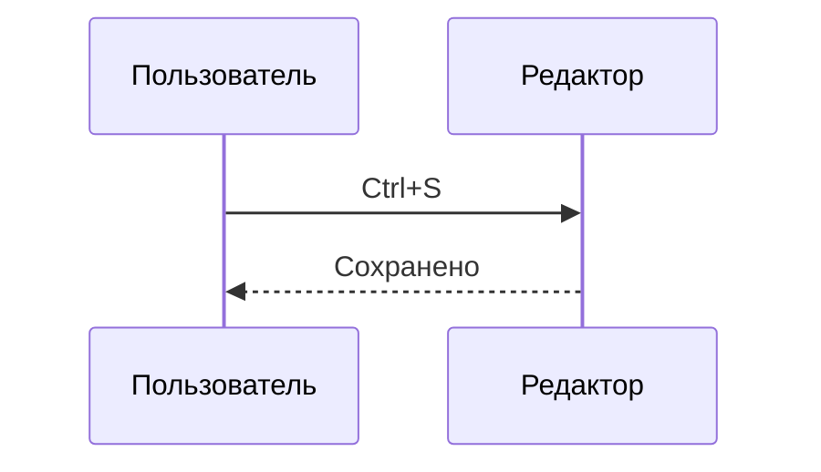

# Проверка рендеринга

Документ с пробелами и кириллицей в имени файла — часть smoke-теста ОС-интеграции.

## GFM

- [x] Таблицы
- [x] Списки задач
- [ ] Linux-пакет

| Платформа | Статус |
|---|---|
| Windows | Готово |
| Linux | Тестируется |

~~Устаревшее~~ и **жирный**, *курсив*, `inline code`, ссылка на https://example.com.

## Изображения

Относительный путь:


## Mermaid




## Код

```rust
fn main() {
    println!("Hello, world!");
}
```

```js
const answer = 42;
```

## Математика

Inline: $E = mc^2$.

$$
P(A|B)=\frac{P(B|A)P(A)}{P(B)}
$$

## Сноска

Текст со сноской.[^note]

[^note]: Тело сноски.

## Вложенность

> Цитата
>
> > Вложенная цитата

1. Первый
2. Второй
   - Вложенный
